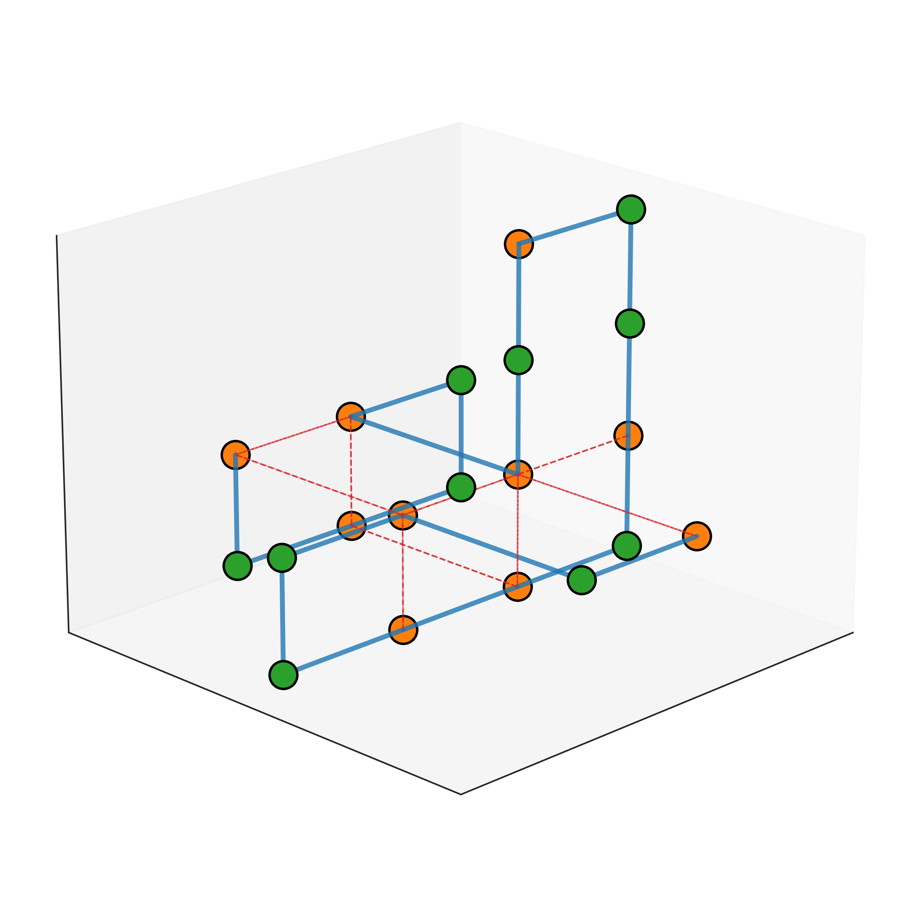

# 3D-HP-DRL

This project implements a 3D Hydrophobic-Polar (HP) model using Reservoir Deep Reinforcement Learning.

## Getting Started

### Prerequisites

- Anaconda or Miniconda
- CUDA-capable GPU (recommended)

### Installation

1. Create a new conda environment:

conda create -n myenv python=3.8.10

2. Activate the environment:

conda activate myenv

3. Install dependencies:

   a. Install conda-forge packages:
      ```
      conda install -c conda-forge \
          gym==0.21.0 \
          numpy==1.21.4 \
          matplotlib==3.5.0 \
          scikit-learn==1.0.1 \
          scipy==1.7.3 \
          prettytable==2.4.0
      ```

   b. Install PyTorch packages:
      ```
      conda install -c pytorch -c conda-forge \
          pytorch==1.10.1 \
          torchvision==0.11.2 \
          torchaudio==0.10.1 \
          cudatoolkit=11.3
      ```

Alternatively, you can use the provided `environment.yml` file:

## Running the Model

To run the model, use the following command structure:

Example:

python main.py hhphphphphhhhphppphppphpppphppphpp 42 50mer-DQN-Seed42-600K 10000 0 &

python main.py [seq] [seed] [name of output directory] [number of episodes for training] [early stop: bool] 


Parameters:
- `seq`: The HP sequence
- `seed`: Random seed for reproducibility
- `name for directory`: Output directory name
- `number of episodes`: Number of training episodes
- `early stop`: Early stopping flag (0 or 1)

## Sample Output

Below is a sample conformation output from the model:



## Current Results

<a href = "https://gtvault-my.sharepoint.com/:f:/g/personal/gespitia3_gatech_edu/EhpR6ofjZR5CtirlwSAMiFgB_tRAOpRgjyDdcAO0i6zDpg?e=GEcO9K">OneDrive</a>
